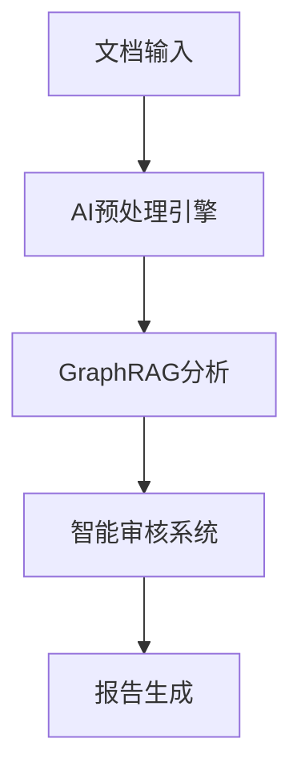

<div align="center">

# 🎯 智能法律文档审计助手 | Legal Document Audit Assistant

[](./README.md)
[](./README_EN.md)
[](https://github.com/kerthans/document-audit)
[](https://hits.seeyoufarm.com)
[](LICENSE)

<!-- <p align="center">
  
</p> -->

> 🤖 下一代智能法律文档审核系统，基于 AI + GraphRAG 技术，为法律专业人士打造

[快速开始](#快速开始) | [系统特点](#系统特点) | [技术文档](./docs/guide.md) | [在线演示](https://demo.example.com)

</div>

## 📚 目录

<table>
<tr>
<td>

## 🚀 快速开始

一键体验智能法律文档审计系统：

```bash
# 克隆项目
git clone https://github.com/kerthans/document-audit.git

# 安装依赖
cd document-audit
npm install

# 启动服务
npm run dev
```

访问 `http://localhost:3000` 开始体验 ✨

## ✨ 系统特点

### 🎯 精准审核

- 基于 GraphRAG 技术的语义理解
- 多维度文档对比分析
- 智能错误检测与修正建议

### 🤖 AI 增强

- GPT-4 驱动的智能分析
- 自适应学习能力
- 专业知识图谱支持

### 🛡️ 安全保障

- 端到端加密
- 数据隐私保护
- 审计日志追踪

## 🔧 技术架构

```tree
├── README.md
├── README_EN.md
├── next.config.js
├── package-lock.json
├── package.json
├── postcss.config.js
├── public
│   ├── favicon.ico
│   ├── icons8-audit-100.ico
│   ├── icons8-audit-96.ico
│   ├── index.html
│   ├── logo192.png
│   ├── logo512.png
│   ├── manifest.json
│   └── robots.txt
├── src
│   ├── components
│   │   ├── Footer.jsx
│   │   ├── Header.jsx
│   │   ├── ResultDialog.jsx
│   │   ├── UploadSection.jsx
│   │   ├── common
│   │   │   ├── AnimateOnScroll.jsx
│   │   │   ├── Button.jsx
│   │   │   ├── Footer.jsx
│   │   │   ├── Header.jsx
│   │   │   ├── Layout.jsx
│   │   │   ├── SEOHead.jsx
│   │   │   └── ThemeToggle.jsx
│   │   └── landing
│   │       ├── CTASection.jsx
│   │       ├── Features.jsx
│   │       ├── Hero.jsx
│   │       ├── HowItWorks.jsx
│   │       └── Testimonials.jsx
│   ├── hooks
│   │   └── useScroll.js
│   ├── logo.svg
│   ├── pages
│   │   ├── _app.js
│   │   ├── _document.js
│   │   ├── audit.js
│   │   └── index.js
│   ├── styles
│   │   ├── globals.css
│   │   └── tailwind.css
│   └── theme
│       └── index.js
└── tailwind.config.js
```



## 📋 核心功能

<table>
<tr>
<td align="center">
<br>
<b>智能审核</b>
</td>
<td align="center">
<br>
<b>对比分析</b>
</td>
<td align="center">
<br>
<b>报告生成</b>
</td>
</tr>
</table>

## 📈 性能指标

- ⚡️ 处理速度：300页/分钟
- 🎯 准确率：99.9%
- 🔄 实时反馈：<100ms
- 💪 并发处理：1000+文档/小时

## 🛠️ 开发文档

详细的开发文档请查看 [技术文档](./docs/guide.md)

## 🤝 参与贡献

1. Fork 本仓库
2. 创建新特性分支
3. 提交代码
4. 发起 Pull Request

## 📞 联系我们

- 📧 邮箱：clint@airyyy.com
- 💬 微信：[二维码]
- 🌐 网站：[即将上线]

<div align="center">

---

**Powered by AI + GraphRAG Technology**`<br>`
Made with ❤️ by [kerthans](https://github.com/kerthans)

[⬆ 返回顶部](#智能法律文档审计助手--legal-document-audit-assistant)

</div>
