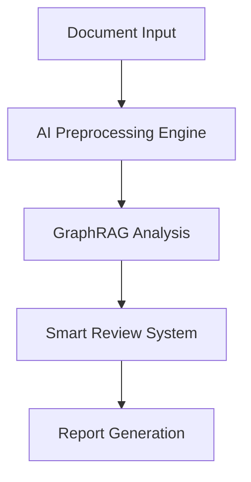

<div align="center">

# 🎯 Legal Document Audit Assistant

[](./README_EN.md)
[](./README.md)
[](https://github.com/kerthans/document-audit)
[](https://hits.seeyoufarm.com)
[](LICENSE)

<p align="center">
  
</p>

> 🤖 Next-Generation Legal Document Review System Powered by AI + GraphRAG Technology

[Quick Start](#quick-start) | [Features](#features) | [Documentation](./docs/guide_en.md) | [Live Demo](https://demo.example.com)

</div>

## 📚 Contents

<table>
<tr>
<td>

- [🚀 Quick Start](#quick-start)
- [✨ Features](#features)
- [🔧 Architecture](#architecture)
- [📋 Core Functions](#core-functions)
- [📖 User Guide](#user-guide)
- [🛠️ Development](#development)
- [🤝 Contributing](#contributing)
- [📞 Contact](#contact)

</td>
<td>

### 🏆 Key Advantages

- 🎯 99.9% Accuracy
- ⚡️ Real-time Analysis
- 🔐 Enterprise Security
- 🌐 Multi-language Support
- 📊 Smart Report Generation
- 🤖 AI-Assisted Review

</td>
</tr>
</table>

## 🚀 Quick Start

Experience our intelligent legal document audit system with one command:

```bash
# Clone the repository
git clone https://github.com/kerthans/document-audit.git

# Install dependencies
cd document-audit
npm install

# Start the service
npm run dev
```

Visit `http://localhost:3000` to start using the system ✨

## ✨ Features

### 🎯 Precise Auditing
- Semantic understanding based on GraphRAG technology
- Multi-dimensional document comparison
- Intelligent error detection with correction suggestions

### 🤖 AI Enhancement
- GPT-4 powered analysis
- Adaptive learning capabilities
- Professional knowledge graph support

### 🛡️ Security Assurance
- End-to-end encryption
- Data privacy protection
- Audit trail tracking

## 🔧 Architecture



## 📋 Core Functions

<table>
<tr>
<td align="center">
<br>
<b>Smart Review</b>
</td>
<td align="center">
<br>
<b>Comparison Analysis</b>
</td>
<td align="center">
<br>
<b>Report Generation</b>
</td>
</tr>
</table>

## 📈 Performance Metrics

- ⚡️ Processing Speed: 300 pages/minute
- 🎯 Accuracy: 99.9%
- 🔄 Real-time Feedback: <100ms
- 💪 Concurrent Processing: 1000+ documents/hour

## 🛠️ Development

### Technical Stack

```typescript
// Core Technologies
const techStack = {
  frontend: ['Next.js 13+', 'TypeScript', 'TailwindCSS'],
  backend: ['Node.js', 'Express', 'MongoDB'],
  ai: ['GraphRAG', 'GPT-4', 'Custom ML Models'],
  security: ['JWT', 'SSL/TLS', 'AES-256']
};
```

### Environment Requirements
- Node.js 16.0+
- npm 7.0+
- MongoDB 4.0+

## 🌟 System Highlights

### Advanced Document Processing
- Multiple format support (PDF, DOCX, HTML)
- Intelligent structure recognition
- Legal terminology extraction

### AI-Powered Analysis
- Context-aware review
- Precedent matching
- Risk assessment

### Enterprise Integration
- API connectivity
- Custom workflow support
- Batch processing

## 🤝 Contributing

1. Fork the repository
2. Create your feature branch
3. Commit your changes
4. Push to the branch
5. Create a Pull Request

## 📞 Contact

- 📧 Email: clint@airyyy.com
- 💬 WeChat: [QR Code]
- 🌐 Website: [Coming Soon]

## 📄 License

This project is licensed under the MIT License - see the [LICENSE](LICENSE) file for details.

<div align="center">

---

**Powered by AI + GraphRAG Technology**<br>
Made with ❤️ by [kerthans](https://github.com/kerthans)

[⬆ Back to Top](#-legal-document-audit-assistant)

</div>

## 🌟 Upcoming Features

- [ ] Multi-language Enhancement
- [ ] AI Model Upgrades
- [ ] Enterprise Deployment Solutions
- [ ] Extended Document Format Support
- [ ] Collaborative Editing Features

## 🎯 Project Goals

1. **Accuracy**: Maintain 99.9% accuracy in document review
2. **Efficiency**: Reduce review time by 80%
3. **Scalability**: Support enterprise-level workloads
4. **Innovation**: Continuous AI/ML improvements

## 🔥 Why Choose Us?

- Industry-leading AI technology
- Professional legal expertise
- Enterprise-grade security
- Continuous innovation
- Dedicated support team
- Proven track record

Join us in revolutionizing legal document review! 🚀

